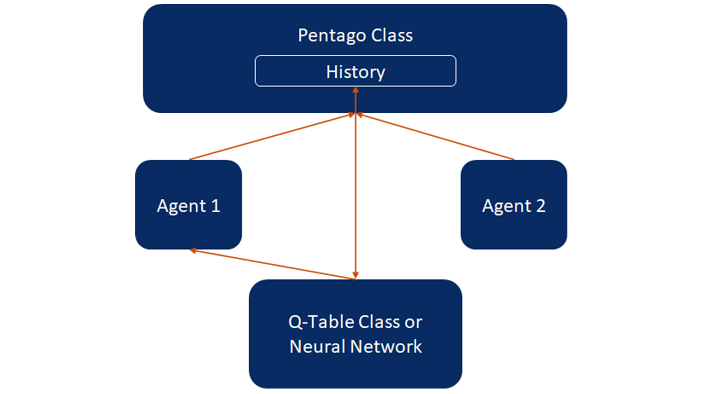
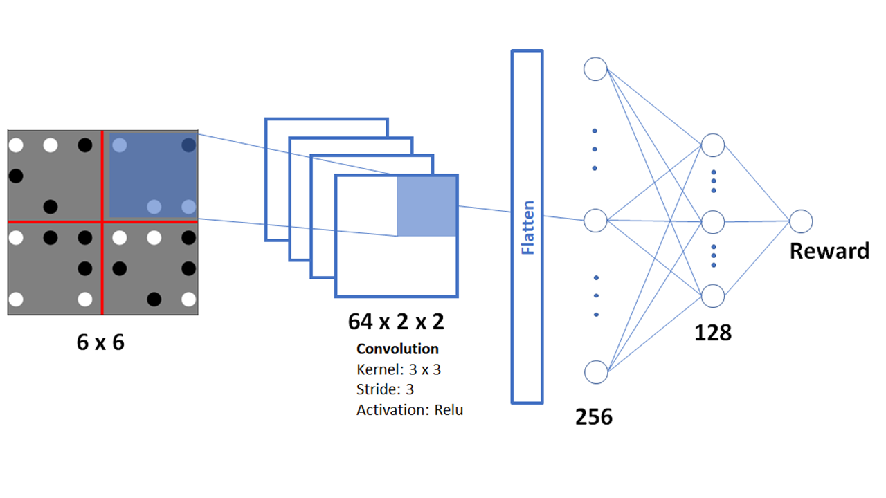
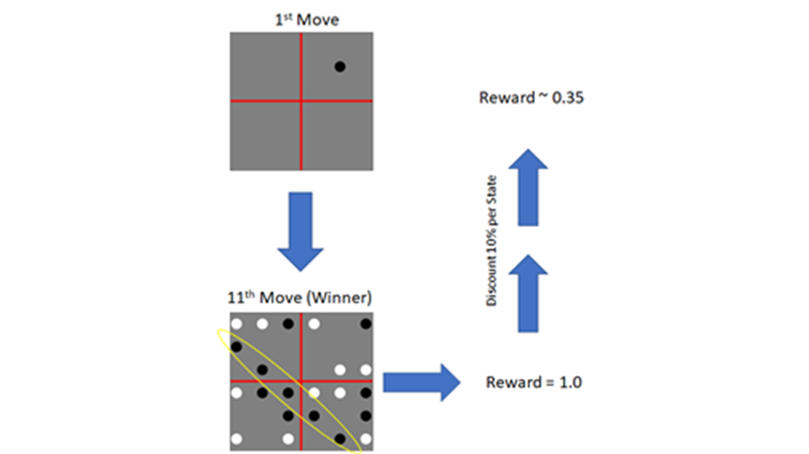
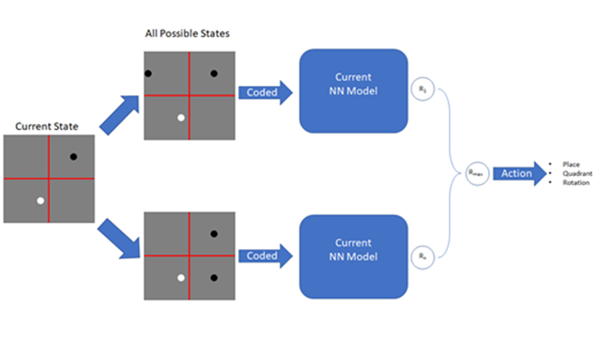
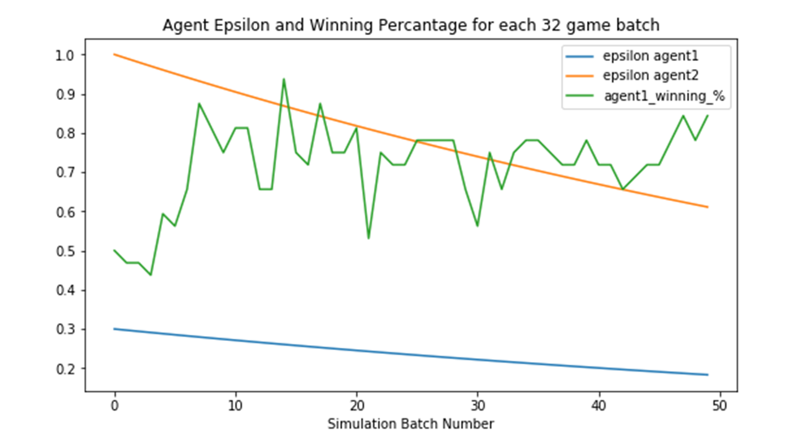

 <h1>Homemade Pentago Champions: A Q-Learning Story</h1> 

 <h3></h3>Joseph Gustad, Scott Robertson and Ernesto Oropeza

<left> <h2>Introduction and Project Goal</h2> </left>

Our team set out with a simple goal: to use reinforcement learning to build an agent that can consistently beat an opposing agent playing randomly. The path to doing this from a blank Jupyter notebook however, was not so simple. Along the way we made a large number of design choices (most of which were good), played hundreds of thousands of games of Pentago that generated millions of board states, and learned an immense amount about the advantages and challenges inherent in brewing your own training data for a project this ambitious.

The report that follows is intended to show the reader more than just the result of our research (wherein we definitely beat a random player, which still fills us with pride). We are most interested in describing the winding path of our investigation into Q-learning, and the structure of the following paper is written in a way that intentionally mirrors the hours of discussions that we had as a team about the best way to go about solving the Pentago problem. 

We start by describing the general Q-Learning principles that we are trying to capture in our program. We then describe the structure of the program that we use as a medium for our Q-Learning exploration. As previously mentioned, we designed the entirety of the game from scratch, which left us with loads of flexibility and many, many ways to get off track. The third section will describe our use of a neural network to accomplish the q-learning task. Finally, we’ll discuss some of the training optimization lessons we learned that come from a scenario where we are able to build a theoretically unlimited amount of training data.

Reinforcement learning is a powerful tool that will only become more useful as edge computing devices render ever more real-world settings into digital form. Our exploration of Pentago has convinced us that the principles that we have learned and applied to this problem can have significant impact on more than just our World Pentago Champion rating.

<left> <h2>General Q-Learning Principles</h2> </left>

Q-Learning was introduced in this class from an autonomous robotics framework.  The general idea is to characterize states and actions in the environment with a Q value.  Given a state (position, velocity, sensor readings, etc) the agent could determine the best available action by looking at q-values.  

Q-values can be determined by consulting data from previous runs.  A rewards function is used to assign value to a particular (state, action).  In robotics there can be many rewards given to a (state, action) pair.  For example, did the robot crash, is the robot closer to a checkpoint, and eventually did the robot complete the task. The Bellman equation is used to assign weights to current state values with future state values at each action point.   A policy can be used to discount future states and the agent will learn to optimize based on this policy.  

Simple implementations will use historical runs to update a tabulated Q-table that can be consulted by the agent.  This implementation is limited however in large (state, action) spaces.  In Deep Q-Learning, a deep neural network can be used to estimate the q-value. As runs are completed the rewards and states, actions can be used to train the neural network to more accurately value states and actions. 

For a strategy game like pentago this paradigm must change in a number of ways.  The first change comes when the agent is given a turn in the game. The environment is completely deterministic for this move.  Because the agent knows exactly the resulting state of the board for each move taken, the current state of the board becomes meaningless and only the next boardstate matters in the decision making.  Further, the action of the agent or move the agent makes is also irrelevant.  The agent can be reduced to choosing from a list of next possible board states.  

Second, after the move and resulting boardstate is recorded, the environment is no longer deterministic.  In fact, it's not even indeterministic, it is antagonistic! (Given the opposing player is trying to win.)  Because of the antagonistic environment, it is futile to predict future states.  Therefore, in an adversarial strategy game like Pentago, intelligence must develop, like Gary Kasparov, a nose for the game.  An ability to evaluate a board state as strong or weak.  In the next sections of the paper, we will explain our learning working through both a simple (tabulated q-value) and Deep Q-Learning agent. 

<left> <h2>Program Design and Interactions</h2> </left>

As previously mentioned, we set out to design our solution from scratch. Starting from zero allowed us to think clearly about the framework that we wanted to use to approach the problem. We chose to build a Python class that would represent the Pentago board, an agent class that we could use to interact with the board game, and a Q table class that we could update as the game progressed. 

<em>Figure 1: Wire diagram of Pentago board / Agent / Q Table interaction</em>

<left> <h3>Game Board</h3> </left>

This was an obvious and essential starting point. This class includes several features that serve as the foundation for the rest of the exercise. This class includes the following attributes:

  * Board state
  * Game history, including the board state, move made, rotation made, and player
  * A method to check for a winner
  * A method to check for a full board, representing a draw
  * A method that allows a “full move”, meaning a combination of a marble placement and a rotation
  * Robust error handling to ensure that all moves made by the agents are legal
  
While the planning for this class was straightforward, it was vital that we ensure that this class accurately maps the behavior of the real game board. In addition to the time we spent ensuring that we faithfully represented the game, we also were careful to make sure that we were recording all of the relevant information needed to update the Q table or train the neural network in the game history object. 

<left> <h2>Agents</h2> </left>

The agent is the mechanism through which we interacted with the game. It was important that we made sure that the agents were capable of being included in a higher level function that ran the game without human interaction. This design is what allowed us to run hundreds of thousands of games over the course of the training period. The agent class has the following functions:

  * Given the board state, get available moves
  * Given the available moves, determine all possible next-board states
  * Make a full move
    - Can be done randomly or with reference to a Q table or Neural Network

The agent class was a vital abstraction that allowed us to accomplish the larger goals of the game. 

<left> <h2>Q-Table or Neural Network</h2> </left>

The objective of our project is to beat a player that is choosing its moves randomly. In order to do this, we needed to create a way for one of the agents to reference a source of “intelligence” to inform its next moves. Broadly, there are two approaches that we attempted in the project: building a Q table and building a neural network. 

The Q table approach was done with the use of a Q table class. At a high level, the Q table class takes the game history as its source of information, looks at the winner of the game, and assigns a reward to the board states chosen by the winning player. In order to incentivize the players to win quickly, the reward function degrades the reward by 10% for each board state prior to the winning board state, meaning that the reward gets asymptotically close to 0 for longer games (1, .9, .81, etc.). The class takes the board states it sees, assigns a reward based on the reward function, and averages that against the previous Q value of that board state. Notably, the problem space in Pentago is so large that one of the major issues we ran into was that even with millions of board states recorded, we still only had a tiny fraction of the possible board states. Practically this meant that many times the “intelligent” agent would reference the Q table for guidance on its next move and find many default Q values. This problem would decrease as the number of training runs increased, but since we only have ~10 million training board states, we would have to create many, many more for the Q table to be complete.

Even with limited board states available this method did see a significant improvement in the winning percentage of the “intelligent” agent. The change was gradual - which we expected since the Q table was being trained in real time - but eventually reached around a 70% win percentage. We discuss further results in the results section.

The second method was to power the “intelligent agent” with a neural network. The concept here is to feed all possible board states to a trained network that can assess the highest value next move from the current board state. This would be put in place of the Q table, and was built as a separate class so that we can simply remove and replace the “intelligence engine” for the experiment. We discuss the specific design considerations and results from this second part of the experiment in the following section.

<left> <h2>Convolutional Neural Network Specifics</h2> </left>

The convolutional Neural Network consists of one convolutional layer and two fully connected layers. The input layer consists of an encoded 6 x 6 x 2 board state where the dimension 2 corresponds to each player position in the board, 1 where a marble is placed and 0 otherwise. The convolutional layer has 64 filters. The kernel is 3x3 with stride size 3 so it captures each quadrant of the board state. The fully connected layers have 256 and 128 neurons respectively. The output layer is a single element with the reward assigned to the input state (Figure 2).

<em>Figure 2. Convolutional Neural Network architecture</em>
  

Training is done by using the board state and its reward. As explained in the previous section, the reward is calculated backward after a game is completed with a winner (Figure 3).  A batch is created with up to 100 completed games where there is a winner. All board states that result from each marble placement are included in the batch with their respective reward. The number of games played in the batch are fixed but the number of states vary from game to game.

<em>Figure 3. Board states for 11 moves and rewards discounted backwards.</em>
  

The agent’s strategy is to use the trained network model to infer the rewards from all possible board states from the current boardstate when taking any action. The number of states can be reduced by removing redundant symmetries as explained in the section above.  The model outputs a reward for each of the resultant. The next action will be the one that generates the board state that has the highest reward. Figure 4 is a representation of this process.

<em>Figure 4. Playing by NN Model. All possible resultant board states are coded to be the input for the NN model. The right part shows all calculated rewards from where the maximum value is taken to make a play.</em>

<left> <h2>Training Optimization </h2> </left>

Efficiently training a network to recognize the value of different boardstates is difficult. Not only must we select the network architecture and hyperparameters, we must also generate data that is of high enough quality to train and converge on.  Also difficult, is the evaluating progress. Because we do not have an already intelligent agent to evaluate on, we continually evaluate on a previous version of the intelligence or a seperate agent with different training parameters like in a GAN. We found that training best converged for a primary agent, when it played an adversary with higher randomness. 

In training we designed the alternating steps of 1. generate data via simulations and 2. train the neural network or q-table in a MapReduce style framework.  During the mapping step, game simulation can be parallelized rather trivially, given the low memory needed for each simulation.  Following the simulation, a reducing step is needed to train the neural network or update the Q Table. Because there is diminishing marginal value to additional data within each simulation step, we chose to limit simulation data to a few dozen games which presented around ~1000 boardstates and corresponding rewards to train on.  

The simulation parallelization was limited to the number of cores on the machine.  The Multiprocessing module builtin to Python provided us an easy way to maximize the use of our cores as it spawns processes that can be completed by each core as they become available.  

In the neural network training we found that the network can spontaneously diverge from a ‘winning’ state after certain simulation steps.  Training on the last 5000 boardstates/ rewards that stretched back into ~5 previous simulation steps helped dampen this behaviour.  

We found that the bottleneck in the training process was the generation of data via simulations.  Depending on the clockrate of a core and the length of a game, simulation will take around 1-2 seconds for a single game.  Parallelizing on 8 cores allowed 32 games to complete in 12 seconds (about a 50% overhead to the parallelization framework, this could be less if we chose to simulate more games.)  From there an update to the neural network and storing variables would take around 2 seconds.  GPU use in the training and inference was determined to not be of help as it training took a very small amount of time in comparison to the simulation. 

<left> <h2>Results</h2> </left> 

  

Agent 1 was able to beat a random agent after these 50 simulation batches and training over 90% of the time.  We found that extended training did not further converge the neural network.  

When two agents were allowed to train against each other for longer periods of time, the neural networks became specialized in playing against each other, and the number of draws increased. Observing these games it appears that the agents work hard to block each other.  Further, these adversarially trained agents perform worse against a random agent, only winning about 80% of the time.  We theorize that we need to increase diversity of opponents and opponent skill sets so that the neural network does not converge on defeating only a specific strategy. 

<left> <h2>Conclusions</h2> </left>  

Our team set out with the simple goal of training an agent to win a Pentago game against an opponent playing randomly. We unequivocally succeeded in that goal. 

Along the way, we learned quite a bit about the strengths, weaknesses, and frictions involved in creating a q-learning agent from scratch. Given more time or a broader mandate, we are confident that we could continue to train this agent to be an increasingly formidable opponent to human players, although this current version is likely a long way from that end state. 

